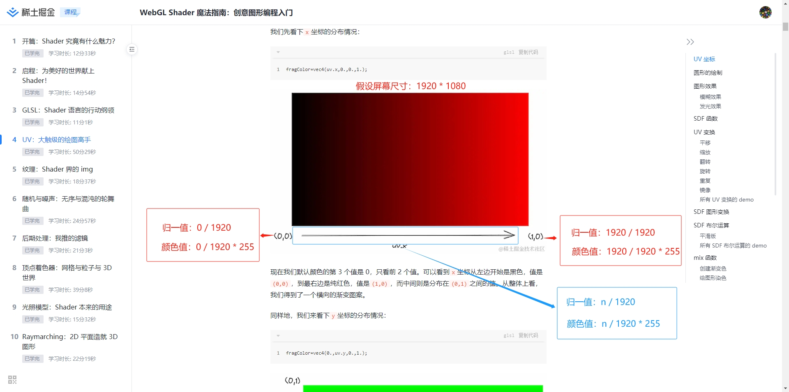
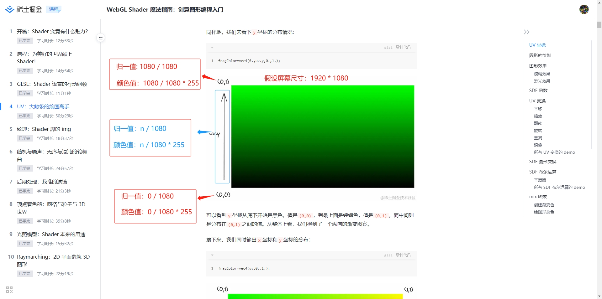
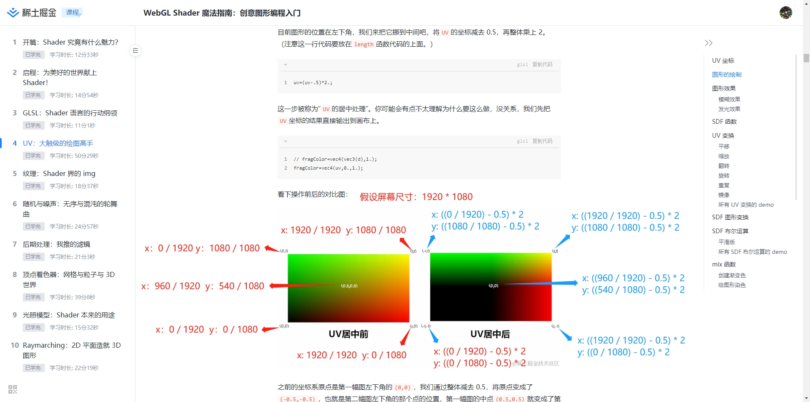
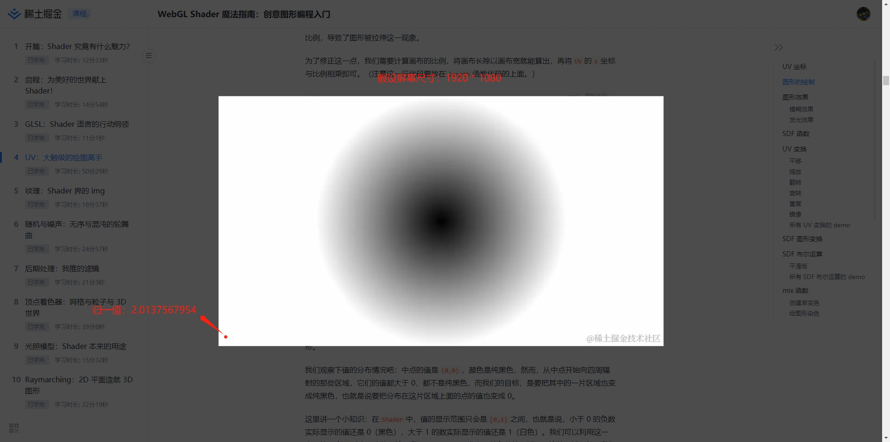
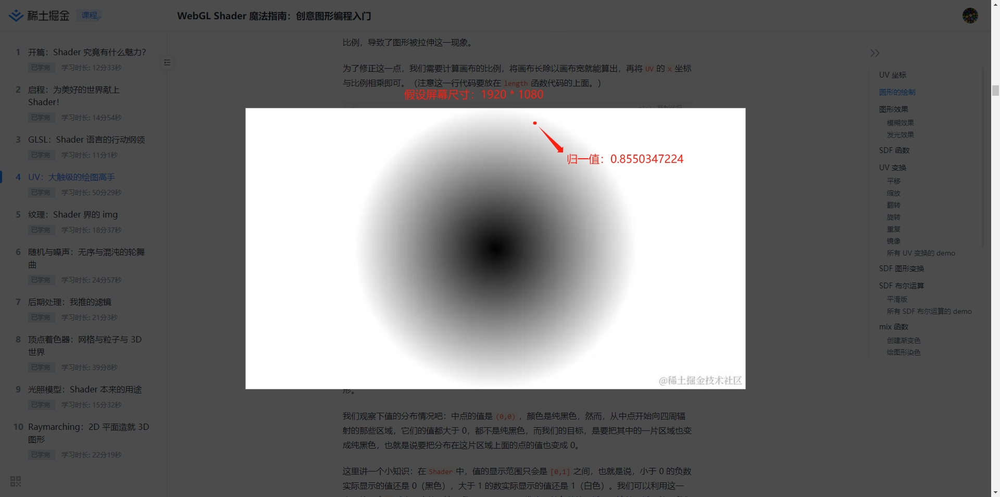

# UV

## UV 坐标

> UV 坐标，它代表了图像（这里指画布）上所有像素的归一化后的坐标位置，其中U代表水平方向，V代表垂直方向  

``` glsl
void mainImage(out vec4 fragColor,in vec2 fragCoord){
    vec2 uv=fragCoord/iResolution.xy;

    // fragColor=vec4(uv.x,0.,0.,1.);
    // fragColor=vec4(0.,uv.y,0.,1.);
    fragColor=vec4(uv,0.,1.);
}
```

- uv.x

  

- uv.y  

  

## 居中

> 目前图形的位置在左下角，我们来把它挪到中间吧，将UV的坐标减去 0.5，再整体乘上 2  
> 然而，图形目前的形状是一个椭圆，这是为什么呢？因为UV坐标的值并不会自动地适应画布的比例，导致了图形被拉伸这一现象。  
> 为了修正这一点，我们需要计算画布的比例，将画布长除以画布宽就能算出，再将UV的x坐标与比例相乘即可

``` glsl
uv = (uv - 0.5) * 2.0;
uv.x *= iResolution.x / iResolution.y;
```



## 圆形的绘制

> 在Shader中，值的显示范围只会是[0,1]之间，也就是说，小于 0 的负数实际显示的值还是 0（黑色），大于 1 的数实际显示的值还是 1（白色）。  
> 颜色值标准范围 0 ~ 255，如果颜色值小于0，它将变为0；如果颜色值大于255，它将变为255。

- 测试示例 1

``` glsl
// fragCoord: 1920 * 1080
void mainImage(out vec4 fragColor, in vec2 fragCoord) {
  // x: 10 / 1920 = 0.0052083333
  // y: 10 / 1080 = 0.0092592593
  vec2 uv = fragCoord / iResolution.xy;

  // x: ((10 / 1920) - 0.5) * 2.0 = -0.9895833333
  // y: ((10 / 1080) - 0.5) * 2.0 = -0.9814814815
  uv = (uv - 0.5) * 2.0;
  // x: (((10 / 1920) - 0.5) * 2.0) * (1920 / 1080) = -1.7592592593
  uv.x *= iResolution.x / iResolution.y;

  // d: length(vec2(-1.7592592593, -0.9814814815)) = 2.0137567954
  // color: 2.0137567954 * 255 = 513.507982827
  float d = length(uv);

  fragColor = vec4(vec3(d), 1.0);
}
```



- 测试示例 2

``` glsl
// fragCoord: 1920 * 1080
void mainImage(out vec4 fragColor, in vec2 fragCoord) {
  // x: 1000 / 1920 = 0.5208333333
  // y: 1000 / 1080 = 0.9259259259
  vec2 uv = fragCoord / iResolution.xy;
  
  // x: ((1000 / 1920) - 0.5) * 2.0 = 0.0416666667
  // y: ((1000 / 1080) - 0.5) * 2.0 = 0.8518518519
  uv = (uv - 0.5) * 2.0;
  // x: (((1000 / 1920) - 0.5) * 2.0) * (1920 / 1080) = 0.0740740741
  uv.x *= iResolution.x / iResolution.y;
  
  // d: length(vec2(0.0740740741, 0.8518518519)) = 0.8550347224
  // color: 0.8550347224 * 255 = 218.033854212
  float d = length(uv);
  
  fragColor = vec4(vec3(d), 1.0);
}
```


